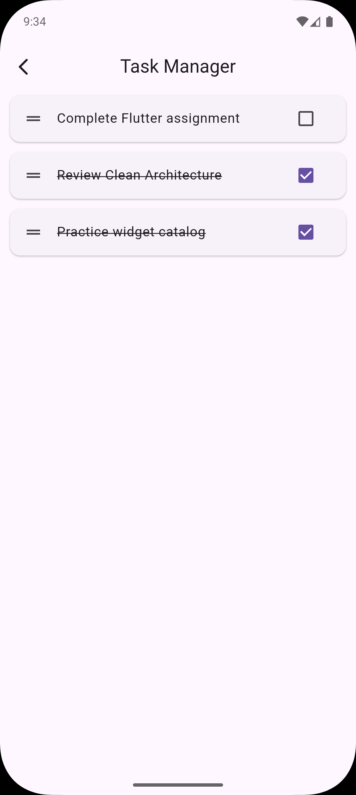
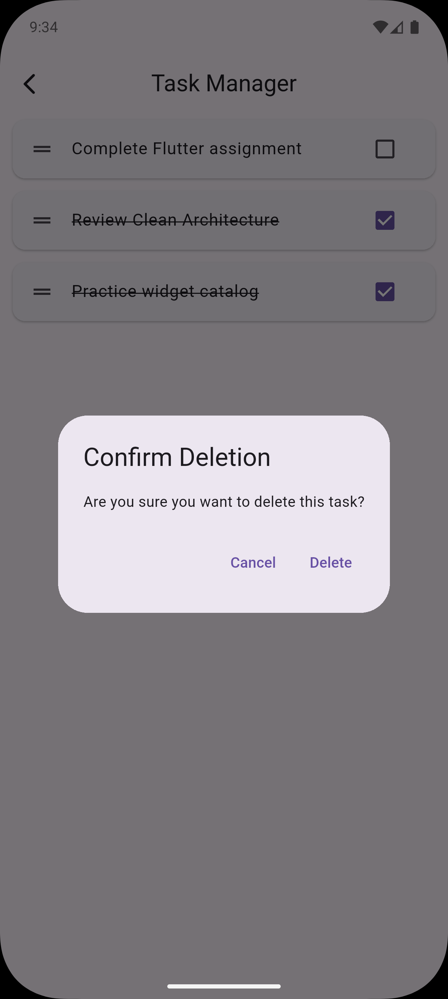
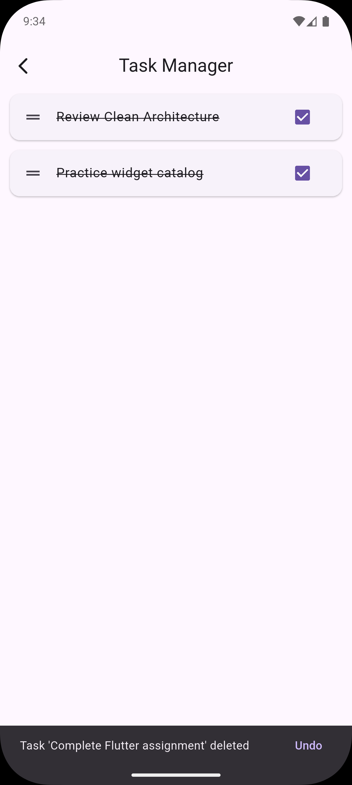
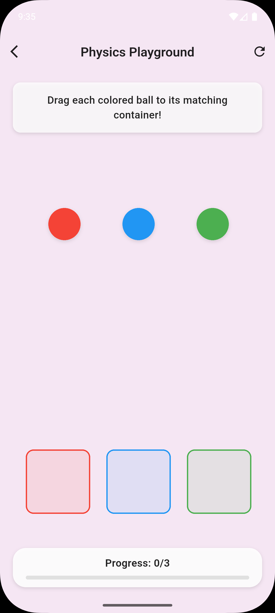
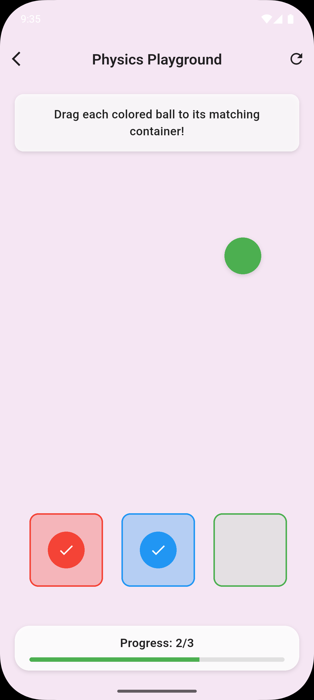
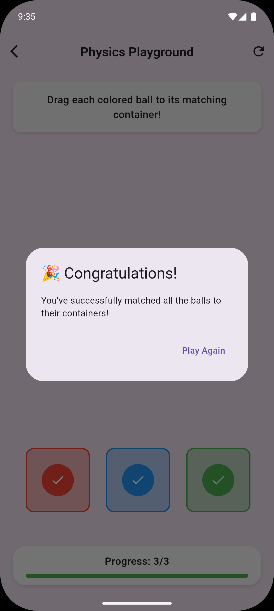
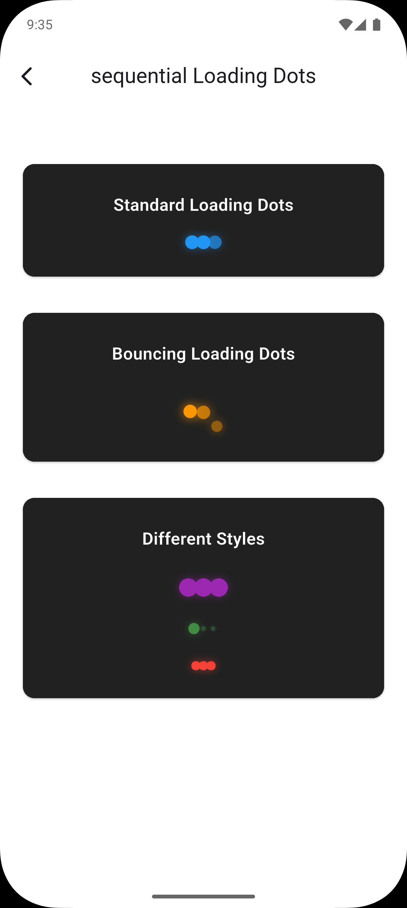

## Flutter Widget Exploration

A showcase app demonstrating three interactive Flutter widget challenges.

- Challenge 1: Interactive Dismissible Lists
- Challenge 2: Interactive Physics Widget (Draggable + DragTarget)
- Challenge 3: Advanced Animation Chain (sequential loading dots)

### Demo Media

<video src="screenrecord/video.mp4" width="640" controls>
  Your browser doesn't support embedded videos. You can download it from
  <a href="screenrecord/video.mp4">screenrecord/video.mp4</a>.
  
</video>

- Screenshots: see the `screenshots/` directory (thumbnails below)

### Table of Contents
- Features
- Screenshots
- Getting Started
- Project Structure
- Implementation Notes (per challenge)

---

### Features

- Challenge 1: Interactive Dismissible Lists
  - Uses `Dismissible` for swipe-to-delete
  - Uses `ReorderableListView` for drag-to-reorder
  - Confirmation dialog before deletion
  - Undo via `SnackBar`
  - Includes at least three sample tasks

- Challenge 2: Interactive Physics Widget
  - `Draggable` colored balls (red, blue, green)
  - Matching `DragTarget` containers with visual feedback
  - Success animation and completion dialog
  - Handles correct and incorrect drops (with shake feedback)

- Challenge 3: Advanced Animation Chain
  - `AnimationController` with proper disposal
  - Three dots animate sequentially
  - Combined scale and opacity tweens per dot
  - Continuous looping with smooth curves

---

### Screenshots

Below are sample screenshots from `screenshots/` (scaled thumbnails):

<p>
  
  
  
</p>

<p>
  
  
  
  
</p>

For a full walk-through, play the embedded video above or open `screenrecord/video.mp4`.

---

### Getting Started

Prerequisites:
- Flutter SDK installed and configured
- A connected device or emulator

Run the app:
```bash
flutter pub get
flutter run
```

The home screen provides quick navigation to all three challenge demos.

---

### Project Structure

- `lib/main.dart` — App entry point and navigation to the demos
- `lib/task_manager_screen.dart` — Challenge 1: Dismissible + ReorderableListView
- `lib/physics_playground_screen.dart` — Challenge 2: Draggable + DragTarget
- `lib/sequential_loading_dots.dart` — Challenge 3: Sequential loading dots animations
- `screenshots/` — Static screenshots used in this README
- `screenrecord/` — Screen recording demo

---

### Implementation Notes

- Challenge 1: Task Manager (`TaskManagerScreen`)
  - `ReorderableListView.builder` enables drag-to-reorder with index adjustment.
  - `Dismissible` wraps each task; `confirmDismiss` triggers a confirmation dialog.
  - On confirmed deletion, a `SnackBar` provides Undo to restore the removed task at the same index.

- Challenge 2: Physics Playground (`PhysicsPlaygroundScreen`)
  - Three `Draggable<String>` balls (red, blue, green) and matching `DragTarget<String>` containers.
  - Visual feedback on hover indicates correct vs incorrect matches.
  - Correct drops scale the container and track progress; incorrect drops trigger a brief shake animation.
  - When all three matches are completed, a congratulatory dialog appears with a reset option.

- Challenge 3: Sequential Loading Dots (`LoadingDotsWidget`, `AdvancedLoadingDots`)
  - A single `AnimationController` drives staggered `Interval` segments for each dot.
  - Each dot has scale and opacity tweens for a smooth pulse effect.
  - An advanced variant adds a bounce (translate) effect while maintaining sequential timing.
  - Animations loop continuously; controllers are disposed properly.

---

### Requirements Checklist

- [x] Dismissible + Reorderable list with confirm dialog and undo
- [x] Draggable + DragTarget physics simulation with visual feedback and success state
- [x] AnimationController-based sequential dots with scale and opacity, looping

---

### Resources

- Flutter docs: [Getting started](https://docs.flutter.dev/get-started/install) · [Cookbook](https://docs.flutter.dev/cookbook)


